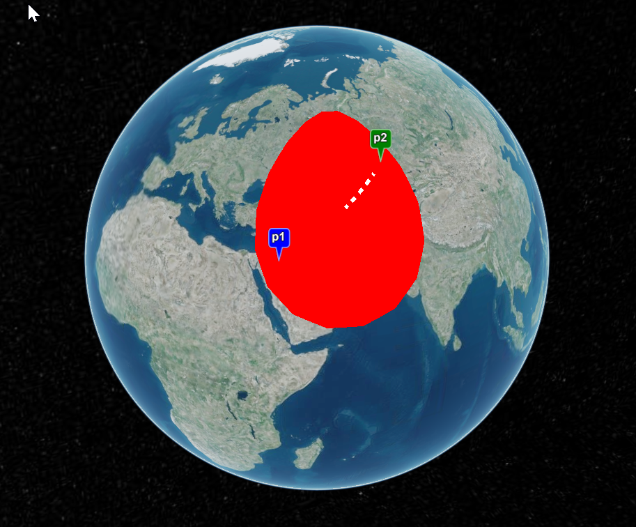

# cesium+rest api sample
draw an elipse and a line between two points.

build and run using .net vs 2022
browse either to [http://localhost:5034/swagger/index.html](the rest API) or the [http://localhost:5034/index.html](Cesium draw demo)

  